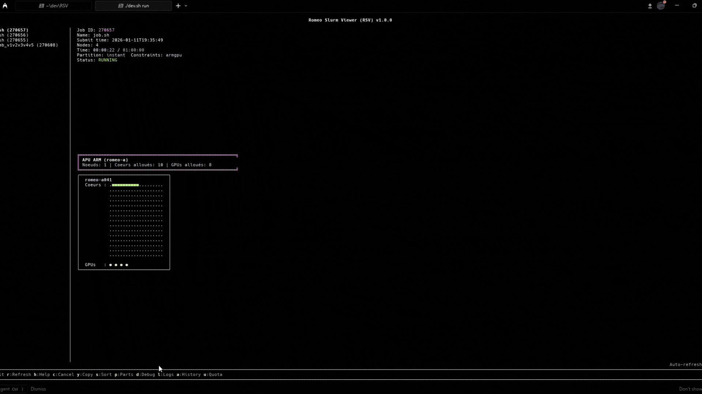

# Romeo Slurm Viewer (RSV)

This small project provides a **Terminal User Interface (TUI)** of your SLURM jobs, showing CPU and GPU allocations per node using characters. It is intended for use on clusters like [ROMEO](https://romeo.univ-reims.fr/).

---

<p align="center">
  
  <br><em>Simple version</em>
</p>

<p align="center">
  
  <br><em>Enriched version</em>
</p>

## Features

- Lists all SLURM jobs for the current user
- Interactive scrolling with mouse wheel
- Auto-refresh every 30 seconds
- UI with a sidebar menu for job selection
- Shows detailed job information:
  - Job ID, Name, Submission time
  - Number of nodes, Elapsed/Max time
  - Partition, Status (color-coded), Constraints
  - **PENDING reason decoding** with actionable suggestions
- Visualizes node allocations for running jobs:
  - CPU usage (`■` = allocated, `.` = free)
  - GPU usage (`●` = allocated, `○` = free)
  - Dynamic expansion of compressed node lists (e.g., `romeo-a[045-046]`)
  - Nodes grouped by APU type (CPU/GPU architecture)
- **Partition view** (`p`): cluster-wide partition status (like `sinfo`)
- **Debug view** (`d`): raw `scontrol show job` output with syntax highlighting
- **Log viewer** (`l`): view stdout/stderr files with scrolling (↑↓ or wheel)
- **History view** (`a`): job history via `sacct` with:
  - Filter by status (ALL/RUNNING/PENDING/COMPLETED/FAILED/CANCELLED/TIMEOUT)
  - MaxRSS memory usage
  - CPU count and elapsed time
  - Exit codes
- **User quota** (`u`): view your resource limits via `sacctmgr`:
  - CPU/Node/Job limits
  - Current usage with progress bars
  - Remaining resources
- **Cancel jobs** (`c`): cancel selected job via `scancel` (with confirmation)
- **Copy job ID** (`y`): copy selected job ID to clipboard
- **Sort jobs** (`s`): cycle through sort modes (ID/Name/Entry)
- Color-coded status:
  - `RUNNING` → Green
  - `PENDING` → Yellow
  - `COMPLETED` → Blue
  - `FAILED` → Red
  - `CANCELLED` → Purple
  - `TIMEOUT` → Red

---

## Prerequisites

- SLURM commands available (`squeue`, `scontrol`, `sinfo`, `scancel`, `sacct`, `sacctmgr`)
- **C++17 compiler** (GCC or Clang recommended)
- **CMake ≥ 3.14**
- Terminal supporting ANSI colors

> Note: FTXUI library is automatically fetched during build via CMake FetchContent.

---

## Building

1. Clone or copy the source code to your workstation or cluster.
2. Create a build directory and compile:

```bash
mkdir build
cd build
cmake ..
make
```

3. This will produce the executable rsv.
4. Libraries are statically linked, so the executable is transferable to your cluster

---

## Usage

1. Run the program:
```bash
./rsv
```

2. The program displays:
- A sidebar menu listing all your jobs
- Details of the selected job in the main panel
- Node allocations with CPU/GPU usage visualized in a grid

### Keyboard Shortcuts

| Key | Action |
|-----|--------|
| `↑/↓` | Navigate job list |
| `Mouse wheel` | Scroll details/logs |
| `r` | Refresh jobs |
| `c` | Cancel job (with confirmation) |
| `y` | Copy job ID (yank) |
| `s` | Sort jobs (cycle modes) |
| `p` | Partition view |
| `d` | Debug view |
| `l` | Log viewer (↑↓ to scroll, Tab for stderr) |
| `a` | History (←→ to filter by status) |
| `u` | User quota |
| `h` / `?` | Show help |
| `q` / `Esc` | Quit |

---

## Symbols (subject to change)

| Symbol | Meaning         |
|--------|----------------|
| `.`    | Free CPU core  |
| `■`    | Allocated CPU  |
| `○`    | Free GPU       |
| `●`    | Allocated GPU  |
